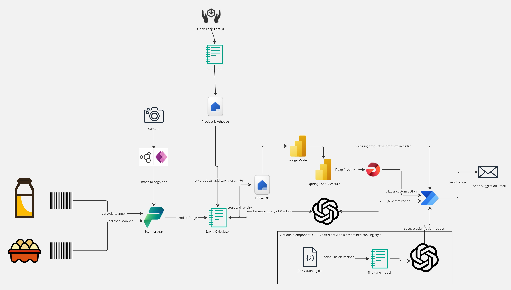

<!-- PROJECT SHIELDS -->
<!--
*** I'm using markdown "reference style" links for readability.
*** Reference links are enclosed in brackets [ ] instead of parentheses ( ).
*** See the bottom of this document for the declaration of the reference variables
*** for contributors-url, forks-url, etc. This is an optional, concise syntax you may use.
*** https://www.markdownguide.org/basic-syntax/#reference-style-links
-->
[![Contributors][contributors-shield]][contributors-url]
[![Forks][forks-shield]][forks-url]
[![Stargazers][stars-shield]][stars-url]
[![Issues][issues-shield]][issues-url]
[![MIT License][license-shield]][license-url]
[![LinkedIn][linkedin-shield]][linkedin-url]

<!-- ABOUT THE PROJECT -->
# Using Fabric and AI to combat Food Waste
## Introduction to the Food Waste Project

* The Use Case
* Architecture overview
* Setting up fabric
* Setting up the Power Platform Solution
* How to test

<!-- GETTING STARTED -->
## The Use Case

Introducing our innovative Food Fighters solution aimed at combatting food waste: a seamless integration of Azure Open AI, Power Apps, Fabric Lakehouses, and Notebooks and much more. Our solution empowers users to effortlessly manage their food inventory, track expiration dates, and receive personalized recipe suggestions via email, all with the simple scan of a product.

Imagine the convenience of scanning each item you purchase and instantly generating a comprehensive fridge inventory. With our solution, keeping track of expiration dates becomes a breeze, eliminating the frustration of discovering forgotten items wasting away at the back of the fridge.

But our solution goes beyond mere inventory management. Leveraging the power of AI, it analyzes your inventory and proactively suggests delicious recipes tailored to the items nearing their expiration dates. Say goodbye to wasted food and hello to inspired culinary adventures!

## Architecture overview

(<a href="#readme-top">back to top</a>)

## Setting up the Power Platform Solution
Download and Import Solution:

Begin by downloading the FoodFightersSLN solution file provided.
Navigate to Power Apps and log in to your account.
Locate the option to import a solution and upload the downloaded FoodFightersSLN file.
Follow the on-screen prompts to complete the import process.
Set Up Connections:

After importing the solution, set up connections to external services as needed.
These connections may include databases, APIs, or other systems required for the solution to function properly.
Ensure that credentials are correctly configured.

(<a href="#readme-top">back to top</a>)

## Setting up fabric
Create Fabric Enabled Workspace:

Navigate to https://app.powerbi.com and create a new fabric enabled workspace.

Set Up First Lakehouse:

Within the fabric enabled workspace, create a lakehouse to serve as a storage repository for imported data.

Run Initial Load:

Add the provided py_loadproducts notebook to the newly created lakehouse.
Execute the notebook to start the initial data load process from Open Food Facts.
This process populates the database with essential product information.

Create Second Lakehouse:

Similarly, within the fabric enabled workspace, establish another lakehouse dedicated to storing data related to the fridge inventory.

Handle Fridge Inventory Data:

Incorporate the py_addtofridge notebook into the second lakehouse environment.
This notebook facilitates the processing and integration of incoming data from the fridge inventory application.

Scan and Send Products:

Begin utilizing the fridge inventory application to scan products and transmit relevant information to the designated lakehouse.

Build Semantic Model:

With the data successfully imported into the lakehouse, proceed to construct a semantic model.

Calculate Expiry Dates:

Within the semantic model, add a DAX expression to calculate the number of days remaining before each product's expiration.
For example:Expires in x Days = DATEDIFF(TODAY(),Min(fridgecontents[expirydate]),DAY)

Create Fridge Inventory Report:

Set up a report within Power BI showcasing the current inventory of products along with their respective expiry dates.

Activate Data Reflex:

Enable data reflex functionality to automate responses based on predefined conditions within the inventory report.

Create user defined action:

Define an action within the reflex to initiate the getrecipe flow when your products are getting closer to their expiration date.

Add Connection Details:

Configure the connection details within the getrecipe flow with the information from your user definec action.
Verify that authentication credentials and endpoint URLs are configured correctly.

(<a href="#readme-top">back to top</a>)

## How to test

Whip out your mobile 

(<a href="#readme-top">back to top</a>)

<!-- CONTACT -->
## Contact

If there are any questions, feel free to reach out!

Alex Dean - adean@allgeier.ch
Christian Todte - christian.todte@allgeier-inovar.de

(<a href="#readme-top">back to top</a>)

<!-- REFERENCES -->
## References

The following documentation was used to source the information contained in this workshop.

* [Azure Architectures](https://learn.microsoft.com/en-us/azure/architecture/browse/)
* [Azure Open AI Service Proxy](https://github.com/microsoft/azure-openai-service-proxy)
* [Fabric Global AI Hack](https://github.com/microsoft/Hack-Together-Fabric-AI)
* [Fabric Tutorials](https://learn.microsoft.com/en-us/fabric/get-started/end-to-end-tutorials)
* [Fabric Open AI How To Guide](https://learn.microsoft.com/en-us/fabric/data-science/ai-services/how-to-use-openai-sdk-synapse?tabs=python)

(<a href="#readme-top">back to top</a>)

<!-- MARKDOWN LINKS & IMAGES -->
<!-- https://www.markdownguide.org/basic-syntax/#reference-style-links -->
[contributors-shield]: https://img.shields.io/github/contributors/AllgeierSchweiz/aihackers.svg?style=for-the-badge
[contributors-url]: https://github.com/AllgeierSchweiz/aihackers/graphs/contributors
[forks-shield]: https://img.shields.io/github/forks/AllgeierSchweiz/aihackers.svg?style=for-the-badge
[forks-url]: https://github.com/AllgeierSchweiz/aihackers/network/members
[stars-shield]: https://img.shields.io/github/stars/AllgeierSchweiz/aihackers.svg?style=for-the-badge
[stars-url]: https://github.com/AllgeierSchweiz/aihackers/stargazers
[issues-shield]: https://img.shields.io/github/issues/AllgeierSchweiz/aihackers.svg?style=for-the-badge
[issues-url]: https://github.com/AllgeierSchweiz/aihackers/issues
[license-shield]: https://img.shields.io/github/license/AllgeierSchweiz/aihackers.svg?style=for-the-badge
[license-url]: https://github.com/AllgeierSchweiz/aihackers/blob/master/LICENSE.txt
[linkedin-shield]: https://img.shields.io/badge/-LinkedIn-black.svg?style=for-the-badge&logo=linkedin&colorB=555
[linkedin-url]: https://www.linkedin.com/company/allgeier-schweiz-ag
[architecture-screenshot]: images/Fabric_AI_Food_Waste_Architecture.png

